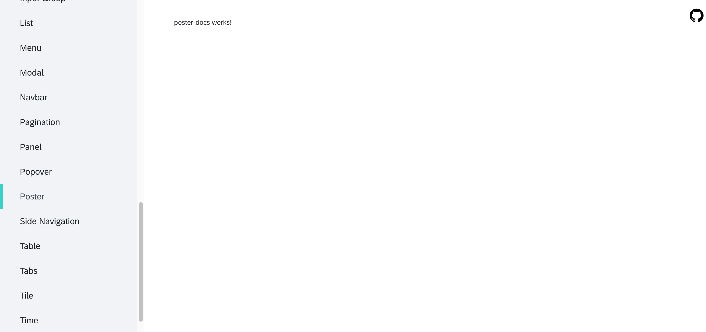
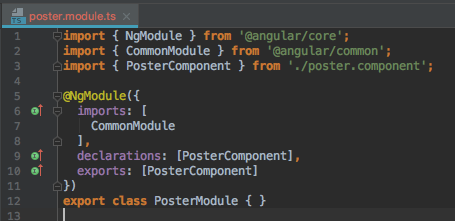
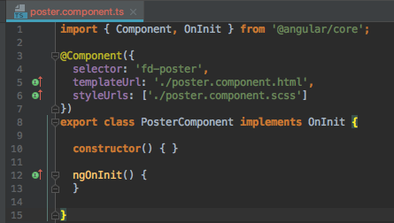
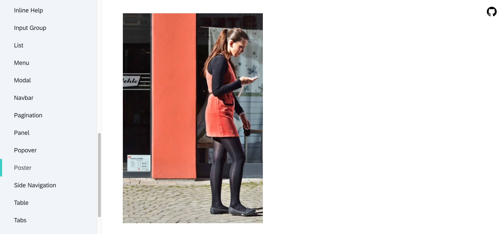

# Implementing a new component for Fundamental NGX

In this guide, we'll explore the library and documentation code base and create a new component of our own.

### Code Base Structure

This repository contains two separate projects - the component library and the documentation application.  Different build tasks are used, depending on which project we're building.  However, the documentation app consumes the library source directly, so there's no need to compile the library to test changes you're making to a component - simply running the documentation app locally will serve changes to the library immediately.

The documentation code base lies in the `docs` directory and the library source is in the `projects/fundamental-ngx/src` directory.

## Generating a new component in the Documentation

Before we start implementing a new component for the library, let's first generate a new empty documentation component so we have somewhere to test the new library component.  From the root of the repository, change into the 'documentation' directory:

`cd docs/modules/documentation`

Then let's generate a new component for the documentation module.  We're going to be building a Poster component, so the new documentation component will be called poster-docs.

`ng generate component containers/poster-docs`

## Adding the new documentation route

Now that we've got our new (empty) documentation for the poster, let's add a poster route, and put a link for the new docs in the 'Components' side bar.

Open `documentation.module.ts` and add the following to the `children` in the `ROUTES` array:

```javascript
{ path: 'poster', component: PosterDocsComponent }
```

Next, open `documentation.component.ts` and add the following to the `components` array:

```javascript
{ url: 'poster', name: 'Poster' }
```

You should see 'Poster' appear in the side navigation under 'Components'.  Clicking the link will load this page:



## Generate a new module in the Library

Next, let's generate an empty module in the library.  Each library component gets its own module, so end users can import only the modules for specific components they intend to use, if they don't want to import the entire library.

Change directories back to the root of the repository.  The library's source lies in the `projects/fundamental-ngx` directory.  From the root of the repo, cd into the library source with:

`cd projects/fundamental-ngx`

`ng generate module src/lib/poster`

Then, generate a 'poster' component in the new module:

`ng generate component src/lib/poster --module=src/lib/poster/poster.module`

Create an `exports` array in the poster module and add the poster component, like so:



Open `poster.component.ts` and change the component's 'app' prefix to 'fd', like so:



The documentation application is importing every component in the fundamental-ngx library source module.  Open `fundamental-ngx.module.ts` and add `import { PosterModule } from './poster/poster.module';` to the list of imports at the top of the file, then add to the array of exports `PosterModule`.

We must also add `export * from './lib/poster/poster.module';` to the `fundamental-ngx/src/public_api.ts` file.

Now, the <fd-poster> component will be available for use by the documentation application.

## Add an image to the Poster component template

In the library source, open `poster.component.html`, remove the default code and add an image with a placeholder.

``````

## Add the Poster component to the Poster Docs template

In the documentation project, open `poster-docs.component.html`, remove the default code and add the new poster component:

```<fd-poster></fd-poster>```

Now, when you navigate to the Poster docs through the side navigation, you'll see our new Poster component!



Refer to other component's documentation source to see how docs-related info is presented.
